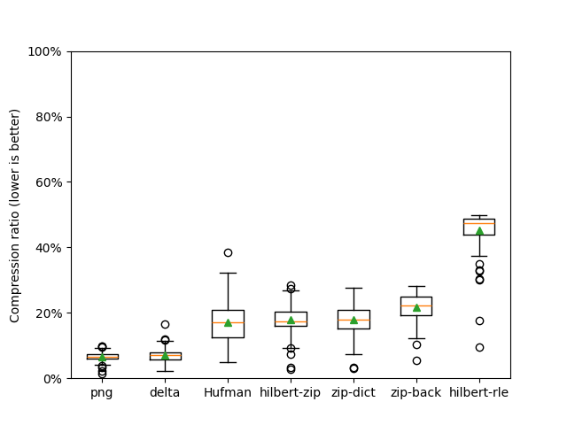
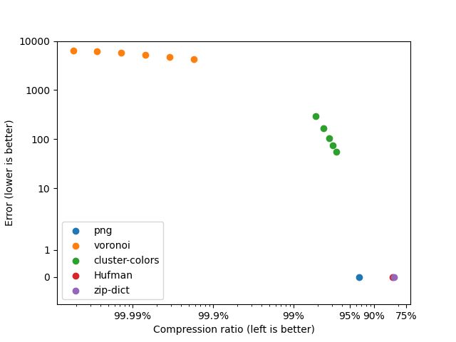

# C-niic

`cniic` (pronounced "C"-nic) is a Compilation of Naive Ideas for Image Compression.

#### What this is about

Have you ever asked yourself the following question?

> If I didn't know about the existing efficient image compression techniques and formats, how would I go about compressing an image?

Well, I did. And this is my attempt at an answer.

This repo implements a number of naive solutions to the general problem of image compression and measures their performance.

### Current status

#### Lossless codecs



Legend:
* `png`: The lossless PNG codec with default parameters
* `Hufman`: Hufman-coding the pixel colors
* `zip-dict`: Zip-inspired online dictionary building
* `zip-back`: Zip-inspired lookback compression
* `hilbert-rle`: Run-Length Encoding on a Hilbert curve traversal
* `hilbert-zip`: `zip-dict` on a Hilbert curve traversal

#### Lossy codecs



The error is computed as the mean square error of each pixel in every image.

Legend:
* `png`: The lossless PNG codec with default parameters
* `Hufman`: Hufman-coding the pixel colors
* `cluster-colors`: cluster the image colors using K-means, then apply Hufman-coding
  * results are shown for 16 colors (top-left), 32, 64, 128 and 256 (bottom-right)
* `voronoi`: cluster the pixels using K-means (position + color). Store only the clusters and reconstruct the image as a Voronoi diagram.
  * results are shown for 64 centroids (left), 128, 256, 512, 1024 and 2048 (right)
* `zip-dict`: Zip-inspired online dictionary building
* `zip-back`: Zip-inspired lookback compression
* `hilbert-rle`: Run-Length Encoding on a Hilbert curve traversal
* `hilbert-rle-approx`: Approximate Run-Length Encoding on a Hilbert curve traversal
  * running average with an allowed color distance of 1 (bottom right), 2, 4, 8, 16 (top left)
* `hilbert-zip`: `zip-dict` on a Hilbert curve traversal

### ASCII art codec descriptions

Who doesn't love ASCII art?
In this section, it's used to help explain the various codecs listed above.

#### zip-dict

```
input:  0x01   0x02   0x01 0x02 0x01 0x02        0x0001 -> 0x01
          |      |    ^^^^^^^^^ ^^^^^^^^^          ...
          |      |        |       |              0x00ff -> 0xff
          v      v        v       v        +...> 0x0100 -> 0x01 0x02
output: 0x0001 0x0002   0x0100 0x0100      :     0x0101 -> 0x0100 0x0100
        ^^^^^^^^^^^^^    ^ ^ ^ ^ ^ ^       :                ^ ^ ^ ^ ^ ^
              +............................+             = 0x01 0x02 0x01 0x02
```

#### zip-back

```
                           .................................
                           v v v v                         :
                                                           :
                                .................          :
                                v v v v         :          :
                  input:  0x01 0x01 0x02 0x02  0x01 0x02  0x01 0x01
                         [^^^^^^^^^^^^^^^^^^^][^^^^^^^^^][^^^^^^^^^]
output:                      |                  |           |
  1. Write the sequence:  ---+                  |           |
     0x01 0x01 0x02 0x02                        |           |
  2. Go back 3 bytes      ----------------------+           |
     Copy 2 bytes                                           |
  3. Go back 6 bytes      ----------------------------------+
     Copy 2 bytes
```

#### hilbert codecs

```
   Hilbert
  traversal
                    +----------+
 5--6  9--a         |6  8  7  7|
 |  |  |  |         |          |
 4  7--8  b         |6  8  7  8|
 |        |         |          |
 3--2  d--c         |7  5  9  9|
    |  |            |          |
 0--1  e--f         |3  3  8  9|
                    +----------+
     |                   |
     +---------+---------+
               |
               v
 0 1 2 3 4 5 6 7 8 9 a b c d e f
+-------------------------------+
|3 3 5 7 6 6 8 8 7 7 7 8 9 9 8 9|
+-------------------------------+
|
+--> hilbert-rle
|
|    [3 3] [5] [7] [6 6] [8 8] [7 7 7] [8] [9 9] [8] [9]
|      |    |   ...
|      v    v
|     2x3  1x5  1x7  2x6  2x8  3x7  1x8  2x9  1x8  1x9
|
|
+--> hilbert-rle-approx
|    assuming allowance = 1
|
|    idx  value  distance            output  running-avg
|     0     3                          no       3
|     1     3    abs(3 - 3) = 0 < 1    no       3
|     2     5    abs(3 - 5) = 2 > 1    2x3      5
|     3     7    abs(5 - 7) = 2 > 1    1x5      7
|     4     6    abs(7 - 6) = 1        no       6.5
|     5     6    abs(6.5-6) = .5 < 1   no       6.33
|     6     8    1.66 > 1              3x6      8
|                .
|                .
|                .
|
|    output: 2x3 1x5 3x6 6x8 4x9
|
|
+--> hilbert-zip

     3 3 5 7 6 6 8 8 7 7 7 8 9 9 8 9
                  |
               zip-dict
                  |
                  v
     0x0003 0x0003 0x0005 0x0007 0x0006 ...
```
