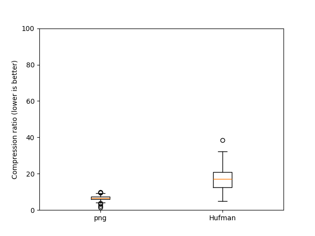

# C-niic

`cniic` (pronounced "C"-nic) is a Compilation of Naive Ideas for Image Compression.

#### What this is about

Have you ever asked yourself the following question?

> If I didn't know about the existing efficient image compression techniques and formats, how would I go about compressing an image?

Well, I did. And this is my attempt at an answer.

This repo implements a number of naive solutions to the general problem of image compression and measures their performance.

### Current status

Legend:
* `png`: The lossless PNG codec with default parameters
* `Hufman`: Hufman-coding the pixel colors
