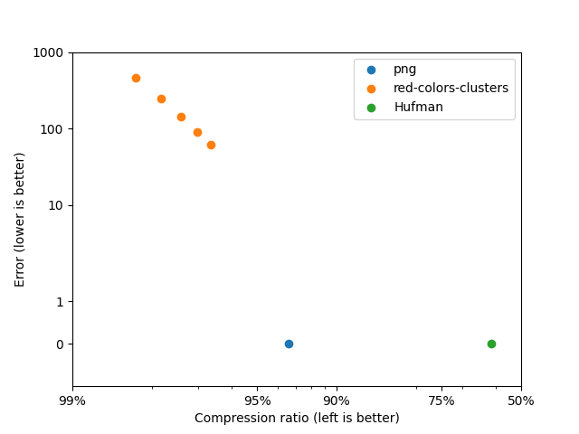

# C-niic

`cniic` (pronounced "C"-nic) is a Compilation of Naive Ideas for Image Compression.

#### What this is about

Have you ever asked yourself the following question?

> If I didn't know about the existing efficient image compression techniques and formats, how would I go about compressing an image?

Well, I did. And this is my attempt at an answer.

This repo implements a number of naive solutions to the general problem of image compression and measures their performance.

### Current status

#### Lossless codecs

Legend:
* `png`: The lossless PNG codec with default parameters
* `Hufman`: Hufman-coding the pixel colors

#### Lossy codecs

The error is computed as the mean square error of each pixel in every image.

Legend:
* `png`: The lossless PNG codec with default parameters
* `Hufman`: Hufman-coding the pixel colors
* `cluster-colors`: cluster the image colors using K-means, then apply Hufman-coding
  * results are shown for 16 colors (top-left), 32, 64, 128 and 256 (bottom-right)
* `voronoi`: cluster the pixels using K-means (position + color). Store only the clusters and reconstruct the image as a Voronoi diagram.
  * results are shown for 64 centroids (left), 128, 256, 512, 1024 and 2048 (right)
